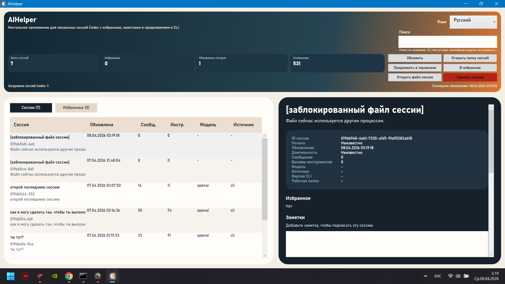
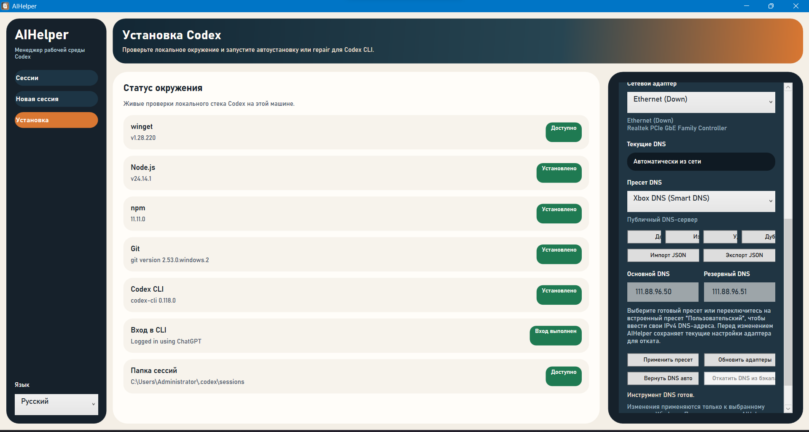
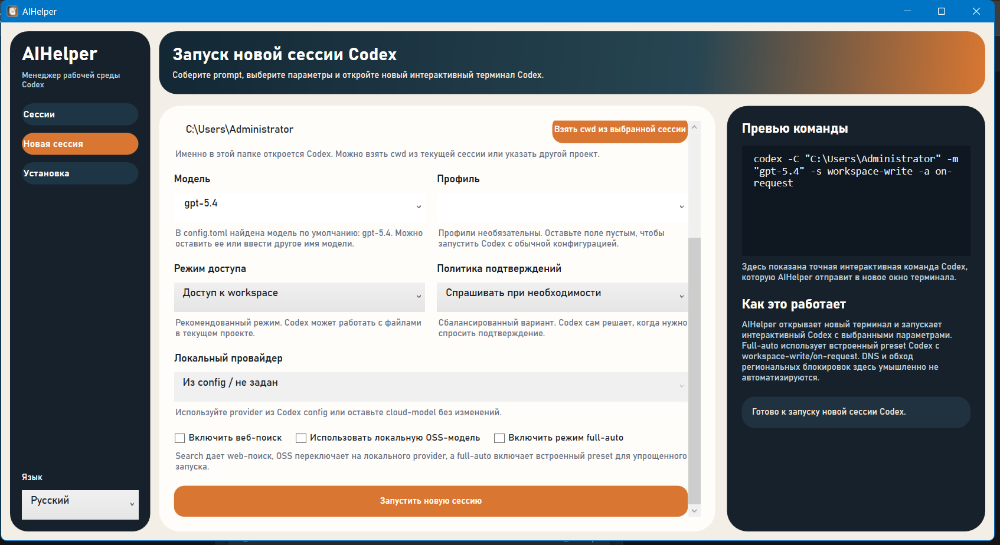

# AIHelper

AIHelper is a Windows WPF desktop app for working with local Codex sessions without dropping into the terminal for routine tasks.

It combines session browsing, session launch presets, environment checks, and Windows DNS management in one desktop utility.

## Screenshots

### Sessions



### New Session



### Setup And DNS



## Features

- Browse local Codex sessions from `%USERPROFILE%\.codex\sessions`
- Search, inspect, favorite, annotate, delete, and resume sessions
- Start a new Codex session with model, profile, sandbox, approval, and OSS options
- Check the local Codex toolchain from the app
- Manage Windows DNS settings with presets, custom presets, import/export, DoH, and rollback
- Switch the UI language between English and Russian

## Download

Download the latest installer from GitHub Releases:

- [Latest release](https://github.com/Havermeng/AIHelper/releases/latest)

The installer is self-contained for `Windows 10/11 x64`, so end users do not need to install .NET manually.

## Installation

1. Download `AIHelper-Setup.exe` from the latest release.
2. Run the installer.
3. If Windows SmartScreen appears, use `More info` -> `Run anyway`.
4. Launch `AIHelper` from the desktop shortcut or the Start menu entry.

## Requirements

- Windows 10/11 x64
- For session management and launch features: Codex CLI installed locally
- For DNS changes: administrator rights

## Build From Source

```powershell
dotnet build .\LaptopSessionViewer.csproj -c Release
dotnet publish .\LaptopSessionViewer.csproj -c Release -r win-x64 --self-contained false -o .\publish\win-x64
```

## Build Installer Locally

```powershell
powershell.exe -NoProfile -ExecutionPolicy Bypass -File .\installer\Build-Installer.ps1
```

The generated installer is written to:

```text
dist\AIHelper-Setup.exe
```

## Release Process

GitHub Actions now builds and publishes the installer automatically for version tags.

To publish the next version:

```powershell
git tag v1.0.1
git push origin main --tags
```

Pushing a `v*` tag triggers the release workflow, which:

- builds `AIHelper-Setup.exe`
- uploads the installer as a workflow artifact
- creates or updates the GitHub Release for that tag
- attaches the installer to the release automatically

## Notes

- DNS presets are stored in `%AppData%\AIHelper\dns-presets.json`
- Session favorites and notes are stored in `%USERPROFILE%\.codex`
- The example DNS preset JSON file is included in `Assets\dns-presets-example.json`
