# AIHelper v1.1.57 — UX и security-аудит

Дата: 2026-07-23  
Среда: Windows, 1347×734, русская локализация, 81 локальная сессия.  
Метод: живой проход по WPF-интерфейсу, проверка accessibility tree, анализ C# и release workflow, сборка и повторный запуск исправленного приложения.

## Итог

Основные сценарии работают, а раздел установки уже даёт новичку хорошую последовательность действий. До исправлений наиболее опасным был запуск с полным доступом без approvals: сохранённые настройки включали его по умолчанию, предупреждение отсутствовало, а основная кнопка была ниже видимой области. Каталог расширений также сразу показывал 567 технических записей и становился нечитаемым.

## Найдено и исправлено

| Приоритет | Проблема | Исправление |
|---|---|---|
| Critical | Полный доступ + «никогда не спрашивать» запускался без action-time подтверждения | Постоянный красный warning и отдельное подтверждение непосредственно перед запуском |
| High | Кнопка запуска новой сессии была ниже fold | Форма разделена: параметры прокручиваются, CTA и warning закреплены снизу |
| High | Prompt и пути передавались через `cmd.exe /k` одной строкой | Codex запускается нативным exe через PowerShell-массив сырых аргументов |
| High | Updater исполнял скачанный installer без проверки целостности | Разрешены только точные GitHub release URL; добавлены лимит 512 MB и SHA-256 verification |
| Medium | Каталог сразу открывал 567 обнаруженных записей, таблица обрезала названия | Старт на 7 рекомендованных пресетах; колонки перераспределены, команда оставлена в detail panel |
| Medium | Названия трёх шагов установки обрезались | Добавлены короткие локализованные подписи прогресса |
| Medium | Холодная загрузка 81 сессии занимала 11 025 мс при каждом новом процессе | Добавлен проверяемый персистентный кэш; следующий запуск загружает список за 72 мс |

## Проверенный пользовательский поток

1. **Сессии — healthy.** Поиск, сводка, таблица, подробности и основные действия доступны. Экран насыщенный; для первого знакомства полезен существующий блок «Как работает список».

   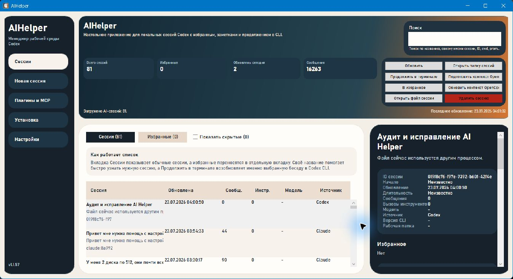

2. **Новая сессия — healthy после исправления.** Параметры остаются в прокрутке, warning и главный CTA видны всегда.

   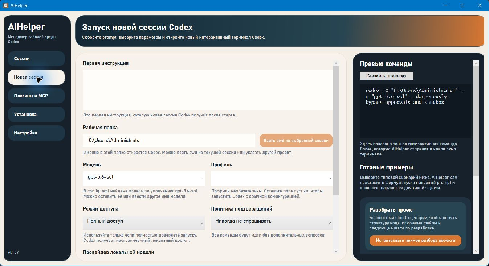
   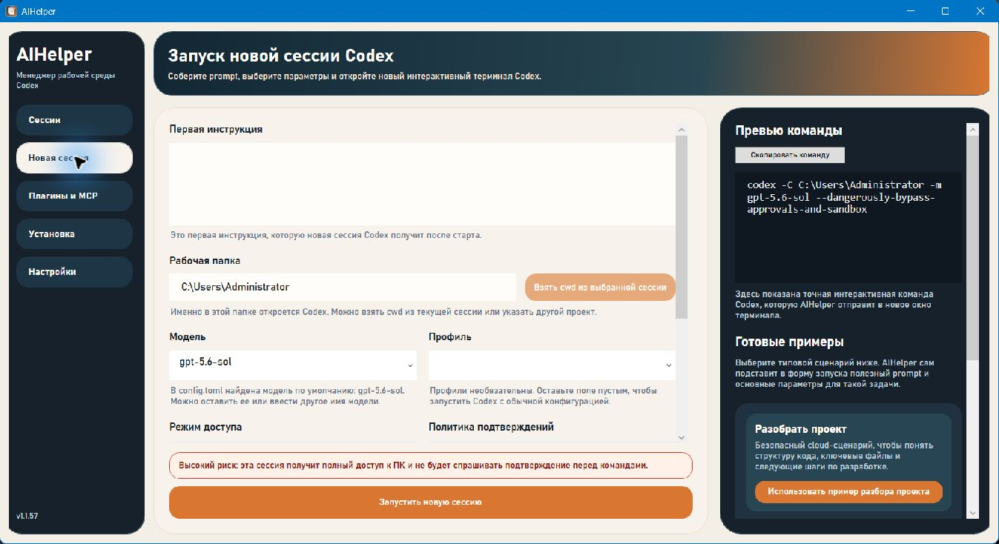

3. **Опасный запуск — healthy.** Повторное подтверждение появляется в момент действия; проверка завершена кнопкой «Нет», новая сессия не запущена.

   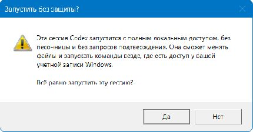

4. **Плагины и MCP — healthy после исправления.** Новичок сначала видит небольшой каталог рекомендаций; обнаруженные локальные записи доступны отдельной вкладкой.

   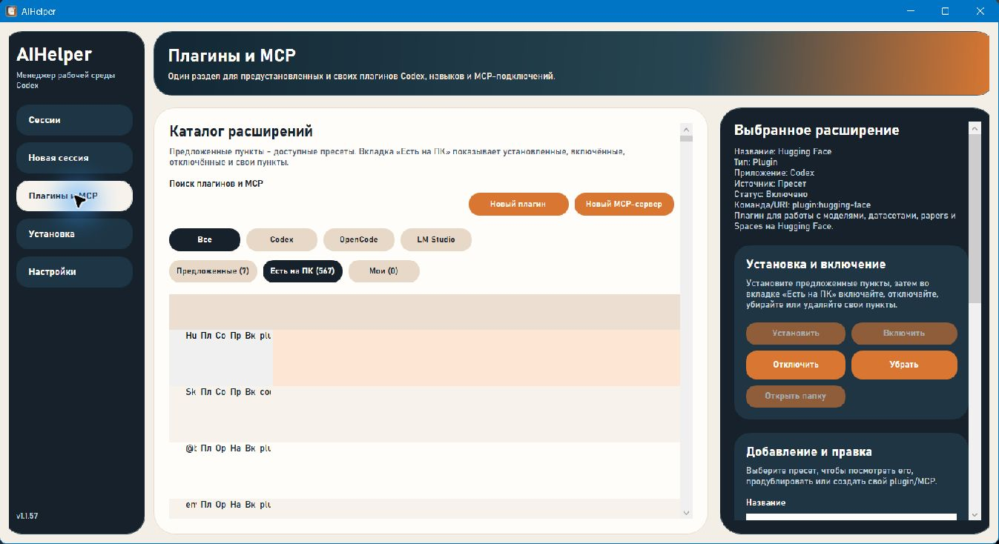
   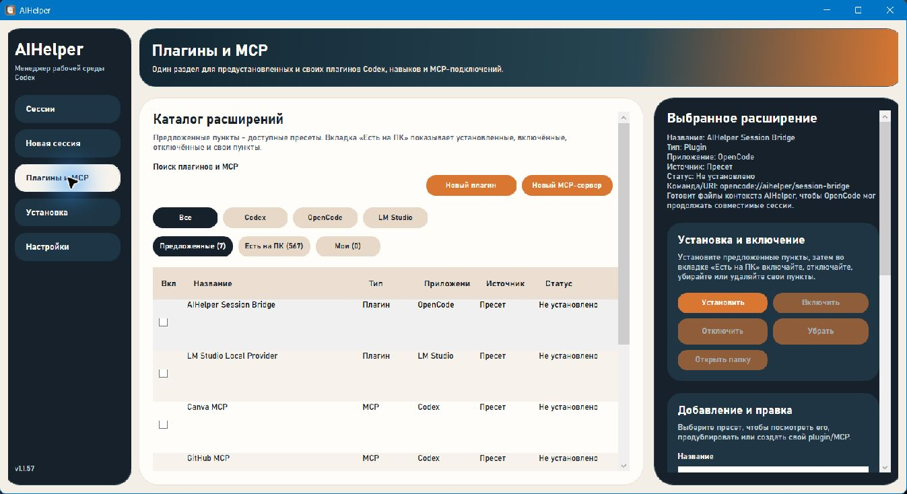

5. **Установка — healthy.** Три последовательных раздела, статусы и памятка для новичка читаются без обрезания.

   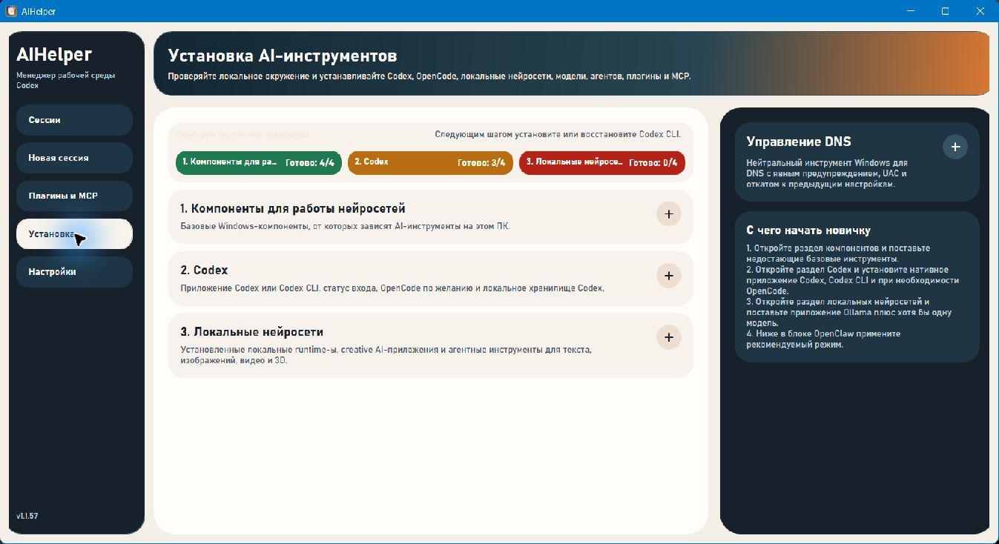
   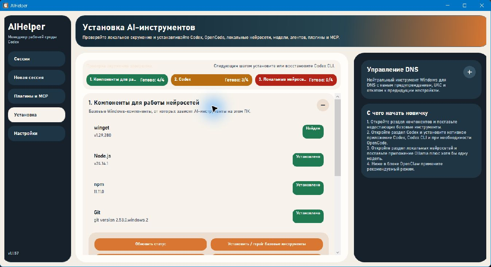
   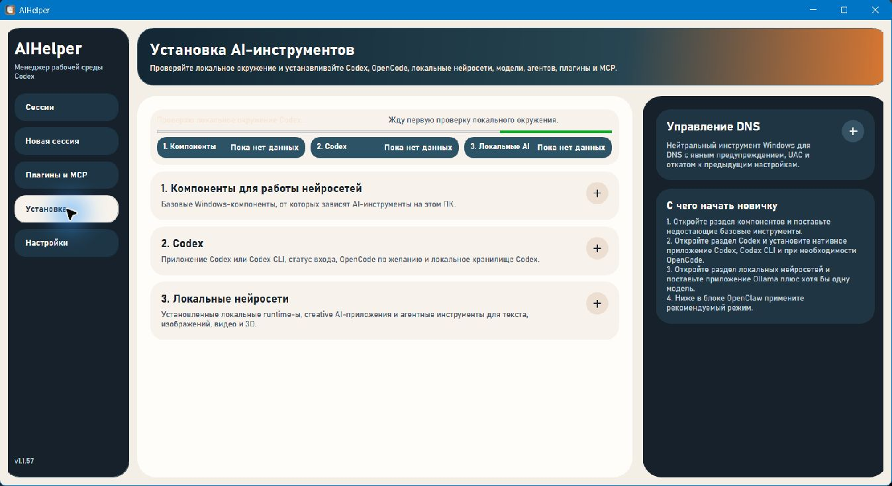

6. **Настройки нейросетей — healthy с предупреждением.** Экспериментальные и опасные параметры описаны явно; action-time защита теперь дублирует настройку.

   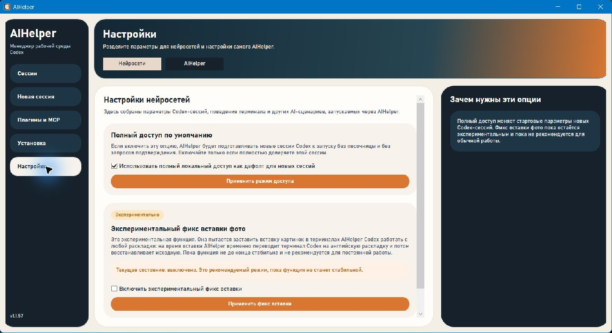

7. **Настройки AIHelper и обновления — healthy.** Текущая версия, последний релиз и доступность действия понятны.

   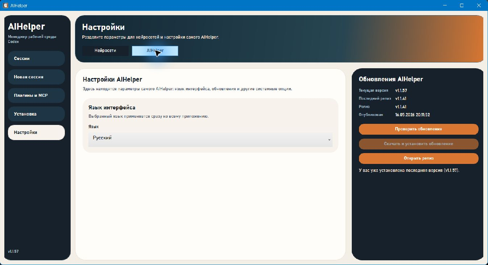

## Проверки

- `dotnet build -c Release`: 0 предупреждений, 0 ошибок.
- Живой запуск исправленного Release build: исключений в логе нет.
- Повторный cold-process load: 81 сессия за 72 мс после создания кэша (до этого 11 025 мс).
- Reflection smoke checks: безопасное формирование raw arguments, checksum parser и отклонение недоверенного updater URL — PASS.
- `git diff --check`: ошибок whitespace нет.

## Ограничения доказательств

Accessibility tree показывает семантические кнопки, вкладки и поля, но один визуальный проход не доказывает полную совместимость со screen reader, контраст во всех состояниях и весь keyboard-only сценарий. Это остаётся отдельной специализированной проверкой, а не подтверждённым дефектом текущего прохода.
