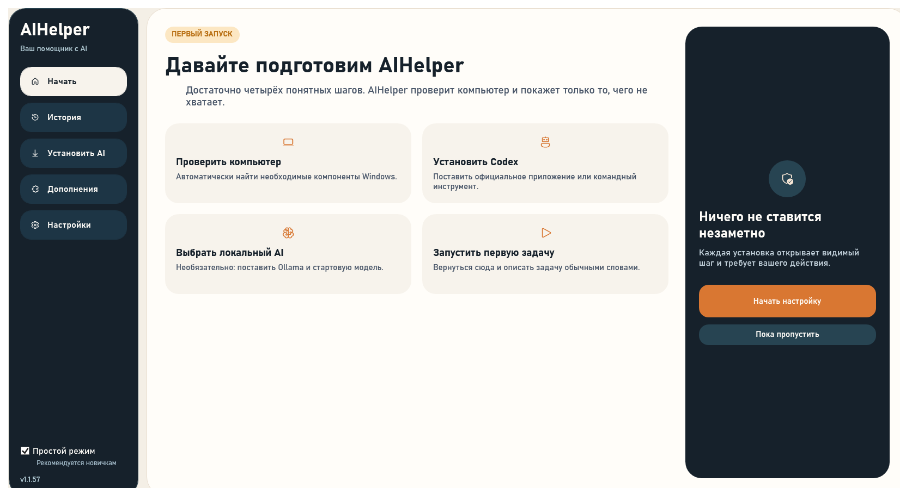
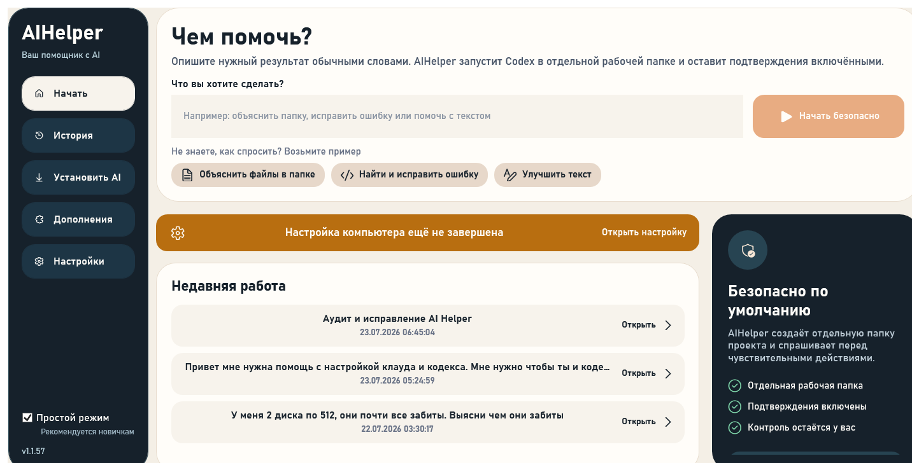
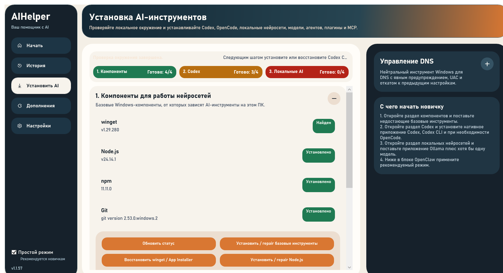
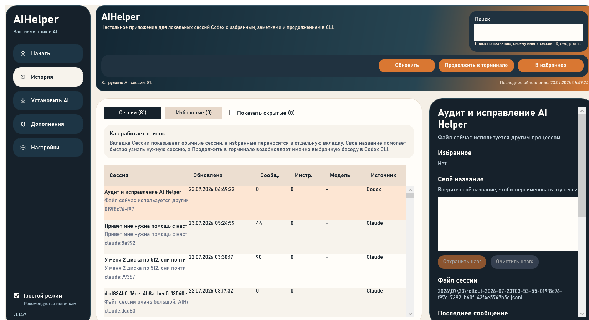
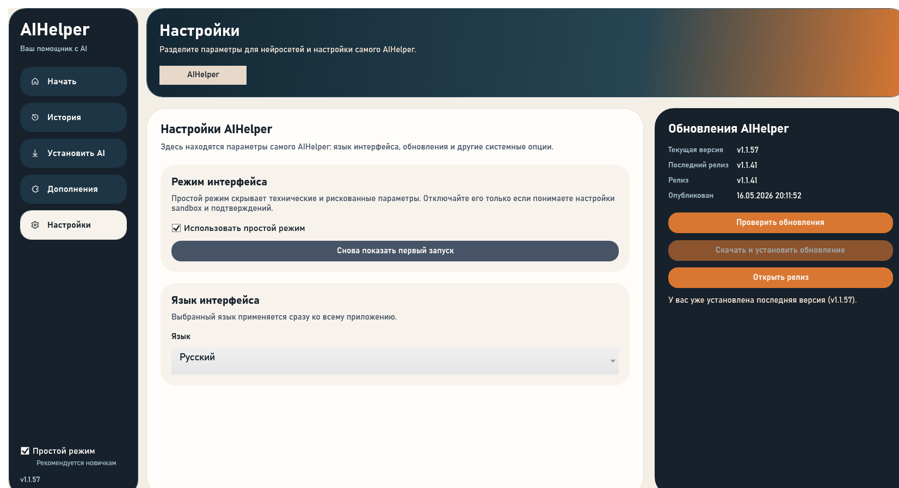
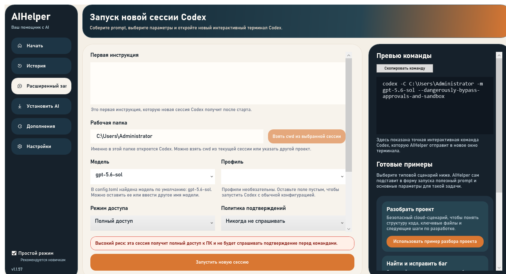

# Повторный UX-аудит AIHelper

Дата: 2026-07-23  
Поверхность: первый запуск, главная, установка, история, настройки и экспертный запуск  
Режим проверки: монитор выключен; навигация и проверка выполнены через код, Win32 и UI Automation, без Computer Use.

## Вердикт

Новая навигация заметно понятнее прежней, но приложение пока нельзя честно назвать готовым для новичка. Основная проблема уже не во внешнем виде: в ключевом сценарии «ввести задачу → запустить» есть логические тупики, невидимые ошибки и преждевременное завершение обучения. Экран установки и история всё ещё требуют технических знаний.

## Шаги

### 1. Первый запуск — состояние: понятно визуально, слабо функционально

Сильная сторона: один заметный призыв к действию, простые формулировки, нет терминальной команды на первом экране.

Проблемы:

- это статичная памятка из четырёх карточек, а не пошаговый мастер;
- кнопка «Начать настройку» сразу записывает обучение как завершённое и только затем открывает установку;
- если закрыть приложение в процессе установки, обучение больше не появится;
- «Пока пропустить» может привести на главную с недоступным запуском без объяснения следующего шага.

### 2. Главная в компактном окне — состояние: основной сценарий ненадёжен

Сильная сторона: вопрос «Чем помочь?» и примеры задач хорошо объясняют назначение приложения.

Проблемы:

- правая карточка не помещается по высоте: кнопка расширенных параметров обрезана, а прокрутки нет;
- новый пользователь может попасть в циклическую блокировку: готовность требует уже существующую папку сессий, хотя она может появиться только после первой сессии;
- проверка готовности принимает установленное Desktop-приложение или CLI, но запуск всё равно требует файл CLI — статусы могут противоречить кнопке;
- пустая задача не блокирует запуск;
- ошибки и подтверждение запуска записываются в `NewSessionStatusText`, который показан только на скрытом экране расширенного запуска. На главной пользователь не увидит причину сбоя;
- безопасный запуск заранее создаёт новую папку проекта; при сбое запуска останется пустая папка.

Кодовые точки: `MainWindow.xaml.cs:526`, `MainWindow.xaml.cs:532`, `MainWindow.xaml.cs:740`, `MainWindow.xaml.cs:2785`, `MainWindow.xaml.cs:2960`, `MainWindow.xaml:1794`, `Services/CodexEnvironmentService.cs:204`.

### 3. Установка AI — состояние: технически полно, для новичка перегружено

Проблемы:

- на одной странице смешаны обязательная установка, диагностика, repair, DNS, локальные модели и OpenClaw;
- `winget`, `npm`, DNS и repair появляются без объяснения, зачем они нужны;
- локальный AI показан красным как проблема, хотя в обучении он назван необязательным;
- текст следующего шага обрезается;
- смешаны русский и английский: «Установить / repair»;
- сообщение «Проверка окружения завершена» почти не отличается от белого фона.

Для простого режима здесь нужен короткий сценарий из трёх шагов: CLI → вход → пробный запуск. DNS, repair, OpenClaw и локальные модели следует вынести в экспертный раздел.

### 4. История — состояние: работает, но остаётся интерфейсом для специалиста

Сильная сторона: опасные массовые действия не торчат на первом плане.

Проблемы:

- новичку показываются ID, источник Codex/Claude, количество инструментов, модель и путь к JSONL;
- ошибка блокировки файла отображается почти как часть имени сессии;
- правая панель перегружена подробностями до выбора реального действия;
- подсказка поиска обрезана.

В простом режиме достаточно названия, даты, короткого фрагмента и действий «Продолжить / Переименовать / В избранное».

### 5. Настройки — состояние: в целом понятно, есть противоречия

Проблемы:

- подзаголовок обещает «параметры для нейросетей», хотя соответствующая вкладка скрыта в простом режиме;
- одновременно показаны установленная версия `v1.1.57`, «последний релиз `v1.1.41`» и сообщение, что установлена последняя версия;
- выключенная кнопка загрузки имеет слишком слабый контраст.

### 6. Экспертный запуск — состояние: предупреждение есть, риск остаётся высоким

Сильная сторона: опасный режим сопровождается заметным красным предупреждением и скрыт от новичка.

Проблемы:

- пункт навигации «Расширенный запуск» обрезается;
- запуск разрешён с пустой инструкцией;
- рабочая папка по умолчанию — весь профиль `C:\Users\Administrator`;
- при сохранённом полном доступе команда использует `--dangerously-bypass-approvals-and-sandbox`;
- экран перегружен настройками и вложенной прокруткой.

## Сквозные проблемы

### Доступность

- UI Automation обнаружил 14 кнопок на главной, у 13 из них пустое доступное имя. Скринридер не сможет объяснить назначение навигации, примеров и основной кнопки запуска.
- Глобальный шаблон кнопки заменяет стандартный WPF-шаблон, но не задаёт видимого состояния фокуса. Это необходимо отдельно проверить клавиатурой; по XAML фокус, вероятно, не виден.
- Контраст белого текста `#FFFDF9` на основной оранжевой кнопке `#D97732` — около `3.12:1`, что ниже `4.5:1` для обычного текста.
- Контраст placeholder `#8A94A3` на `#F7F3EC` — около `2.77:1`.
- Светлый статус `#F8E7D6` на `#FFFDF9` — около `1.19:1`.

Это не проверка соответствия WCAG целиком: без ручного прохода Tab/Shift+Tab, скринридера, масштабирования Windows и High Contrast полную доступность подтвердить нельзя.

## Приоритет исправлений

1. Исправить логику готовности и убрать зависимость первого запуска от уже существующей папки сессий.
2. Показать статус запуска прямо на главной и запретить пустую задачу.
3. Считать обучение завершённым только после успешной настройки или явного подтверждения пропуска.
4. Добавить доступные имена всем кнопкам и видимый клавиатурный фокус.
5. Сделать главную адаптивной по высоте, без обрезания.
6. Сократить простую установку до обязательного минимума, технические инструменты перенести в экспертный режим.
7. Упростить историю и устранить противоречие версий в настройках.

## Ограничения проверки

- Монитор оставался выключенным; Computer Use не использовался.
- Скриншоты получены из текущей WPF-разметки через временный диагностический рендер и проверены по файлам.
- Реальный вход в Codex, сетевые установки, запуск новой сессии и клавиатурный/скринридерный проход не выполнялись, чтобы не менять внешнее состояние и пользовательские данные.
- Принятые доказательства: `01-onboarding.png`, `03-home-small.png`, `04-setup.png`, `05-history-retry.png`, `06-settings.png`, `07-expert.png`. Остальные файлы в папке — отклонённые диагностические кадры и в выводах не использовались.
